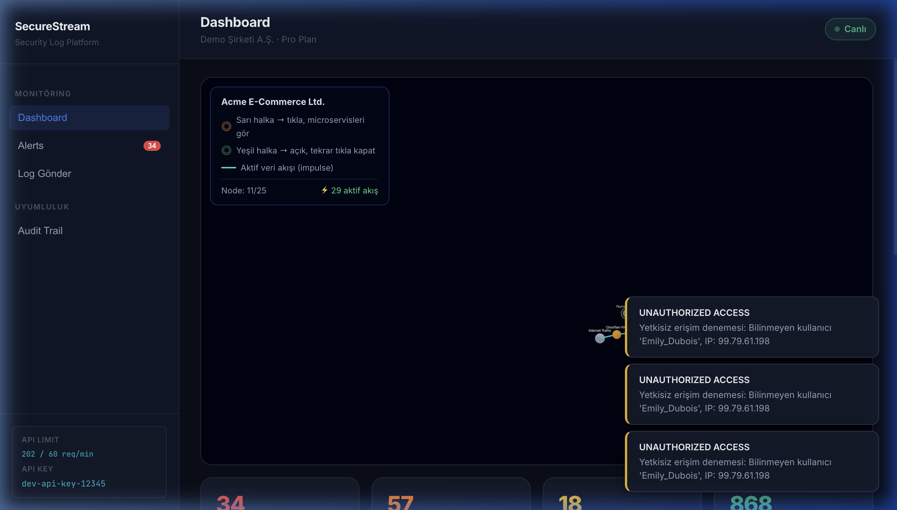
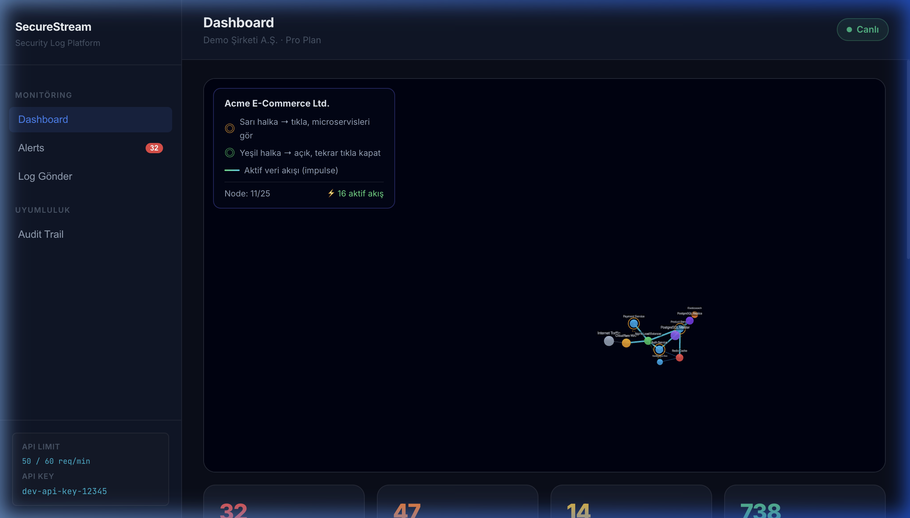

# 🛡️ SecureStream AI: Autonomous Security Diagnostics Platform

SecureStream AI is a high-performance, autonomous security monitoring and diagnostics platform designed for modern B2B microservice architectures. It combines real-time concurrent log processing with a stunning 3D topology visualization and an AI-powered security assistant (J.A.R.V.I.S) to provide proactive threat management and system observability.


## 🚀 Key Features

### 1. 🌌 Interactive 3D Network Topology
Visualize your entire microservice ecosystem in a dynamic 3D space. 
*   **Real-time Data Flows:** Watch "impulse signals" travel between nodes as logs are processed.
*   **Hierarchical Deep-Dive:** Click on a service to expand and view internal microservices and functional call chains.
*   **Visual Health Indicators:** Nodes change color based on health status (latency, errors, or security threats).



### 2. 🤖 J.A.R.V.I.S AI Security Assistant
Integrated autonomous security agent powered by **Llama-3 (Groq API)**.
*   **Natural Language Commands:** Speak or type commands like *"Block the IP address 185.220.x.x"* or *"Give me a summary of the latest critical threats."*
*   **Voice Interaction:** Fully localized English voice (Male) with speech recognition and synthesis.
*   **Autonomous Blocking:** J.A.R.V.I.S can automatically update the system-wide firewall to reject traffic from malicious sources.

### 3. ⚡ High-Concurrency Log Engine
Built with **Go**, the backend is designed to handle thousands of logs per second using a worker pool architecture.
*   **Pattern Matching Engine:** Real-time detection of Brute Force, SQL Injection, Port Scans, and Unauthorized Access.
*   **Multi-tenancy:** Complete data isolation for different companies using API-Key authentication.
*   **Rate Limiting:** Integrated Redis-based rate limiting to prevent ingestion floods.

### 4. 📊 Observability & Control
*   **Uptime Monitoring:** Real-time latency and health stats for core infrastructure components.
*   **Action Control Panel:** A transparent audit trail for all autonomous security actions and blocked IPs.
*   **Live Log Stream:** Filterable, high-speed log view with instant threat highlighting.



## 🛠️ Technology Stack

*   **Backend:** Go (Gin Framework), Redis (Rate Limiting), PostgreSQL (Audit Trails), Gorilla WebSocket (Live Streams).
*   **Frontend:** React, Vite, `react-force-graph-3d` (Topology), CSS-in-JS (Premium Glassmorphism Design).
*   **AI/LLM:** Groq Llama-3 (8B/70B) for intent processing and natural language interaction.
*   **DevOps:** Docker Compose for full-stack containerization.


## 📦 Getting Started

### Prerequisites
*   Docker & Docker Compose
*   Groq API Key (for JARVIS AI features)

### Installation

1.  Clone the repository:
    ```bash
    git clone https://github.com/NiyaziMert/Concurrent-Log-Streamer.git
    cd Concurrent-Log-Streamer
    ```

2.  Set up environment variables:
    ```bash
    export GROQ_API_KEY="your_api_key_here"
    ```

3.  Launch the platform:
    ```bash
    docker compose up -d --build
    ```

4.  Access the Dashboard:
    Open `http://localhost` in your browser.

---
*Created with ❤️ by SecureStream AI Team*
