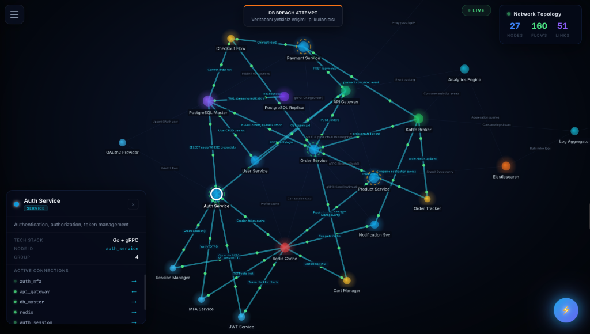

# 🛡️ SecureStream AI: Autonomous Security Diagnostics Platform

SecureStream AI is a state-of-the-art, autonomous security monitoring and diagnostics platform designed for high-scale B2B microservice environments. It bridges the gap between raw log data and actionable security intelligence through immersive 2D force-directed topology visualization and AI-driven automation.



## 🌟 Vision & Overview

In modern distributed systems, observability is often buried under flat logs and complex tables. SecureStream AI transforms this by providing:
1.  **Immersive Observability:** A 2D force-directed graph with real-time data flow animations, link labels, and node detail panels.
2.  **Autonomous Response:** An AI agent (J.A.R.V.I.S) that not only detects but also acts to neutralize threats.
3.  **High-Performance Ingestion:** A Go-powered engine capable of processing massive log streams with sub-millisecond latency.

---

## 🚀 Feature Deep-Dive

### 1. 🌐 Interactive 2D Network Topology
The centerpiece of SecureStream is our interactive 2D force-directed topology, powered by `react-force-graph-2d`.
*   **40+ Service Nodes:** Complete microservice architecture including API Gateway, Auth, Product, Order, Payment, Analytics, Logging services, and their sub-components.
*   **Real-time Data Flows:** Every log processed by the backend triggers animated particles traveling between source and destination nodes.
*   **Link Labels:** Zoom in to see exactly what data flows between services — API calls, gRPC methods, SQL queries, cache operations.
*   **Node Detail Panel:** Click any node to see its description, tech stack, node type, and active connections in a sleek glassmorphic panel.
*   **Hierarchical Expansion:** Click service clusters to expand and reveal internal microservices and function calls.
*   **Collision-Free Layout:** D3 force simulation with charge repulsion ensures nodes never overlap.

### 2. 🤖 J.A.R.V.I.S: Autonomous Security Assistant
Beyond simple dashboards, SecureStream features **J.A.R.V.I.S**, an AI agent integrated with **Llama-3 (Groq)**.
*   **Intent Processing:** J.A.R.V.I.S understands natural language. You can say: *"Give me a status report on the database"* or *"Block any IP attempting SQL injection."*
*   **Autonomous Action:** When an IP is identified as malicious, J.A.R.V.I.S can autonomously add it to the global `blockedIPs` map, effectively creating an API-level firewall.
*   **Interactive UI:** A glassmorphic chat interface with full voice-to-text (SpeechRecognition) and text-to-voice (SpeechSynthesis) support.

### 3. ⚡ High-Throughput Pattern Engine
Our Go-based backend implements a concurrent log processing pipeline:
*   **Worker Pool Architecture:** Thousands of log entries are distributed across a pool of goroutines, ensuring non-blocking execution even under heavy load.
*   **Security Regex Suite:** Real-time scanning for:
    *   **Brute Force:** Tracks IP-based login attempts with time-decay counters.
    *   **SQL Injection:** Detects common patterns like `UNION SELECT` or `1=1`.
    *   **Port Scanning:** Identifies firewall `DROP` patterns.
    *   **Privilege Escalation:** Monitors unauthorized `sudo` attempts.

### 4. 📊 System Control & Uptime Monitoring
*   **Action Control Panel:** A dedicated audit trail showing every IP blocked by the AI or the automated engine, ensuring transparency in autonomous decisions.
*   **Uptime Diagnostics:** Continuous health-check simulation for core infrastructure (Nginx, PostgreSQL, Redis, Auth Service), visualizing latency and availability percentages.

---

## 🏗️ Technical Architecture

### **Backend (The Core)**
*   **Language:** Go (1.24+)
*   **Concurrency:** Heavy use of Goroutines and Channels for log ingestion and alert broadcasting.
*   **Framework:** Gin Gonic (REST API) & Gorilla WebSocket (Real-time Streaming).
*   **Database:** PostgreSQL for persistent audit logs and Redis for high-speed rate limiting.

### **Frontend (The View)**
*   **Library:** React 18+ with Vite.
*   **Visualization:** react-force-graph-2d (Canvas-based 2D force-directed graph).
*   **Styling:** Custom Vanilla CSS with Glassmorphism and CSS Variables for dynamic themes.

### **Client Simulator**
*   **40+ Topology Nodes:** CDN, DNS, WAF, Nginx, API Gateway, Auth, User, Product, Order, Payment, Notification, Analytics, Logging services with sub-services and function-level nodes.
*   **80+ Labeled Links:** Each connection describes the data flow (API endpoints, gRPC calls, SQL queries, Kafka events).
*   **Realistic Traffic:** Generates diverse logs across all services including cache operations, search queries, order sagas, and payment processing.

### **Multi-Tenancy**
SecureStream is built for SaaS. Each client is isolated via unique **API Keys**. The backend automatically partitions data and WebSocket broadcasts based on the Tenant ID identified during the handshake.

---

## 📦 Getting Started

### 1. Prerequisites
*   Docker & Docker Compose
*   **Groq API Key:** Required for J.A.R.V.I.S AI features. [Get one here](https://console.groq.com/).

### 2. Deployment
```bash
# Clone the repo
git clone https://github.com/NiyaziMert/Concurrent-Log-Streamer.git
cd Concurrent-Log-Streamer

# Set your API Key
export GROQ_API_KEY="your_api_key_here"

# Start the stack
docker compose up -d --build
```

### 3. Usage
Access the platform at `http://localhost`. 
To simulate traffic, the `client-simulator` service will automatically start and begin streaming high-frequency log data to your instance.

---
*Developed by **SecureStream AI Team** - Empowering Security with Autonomy.*
